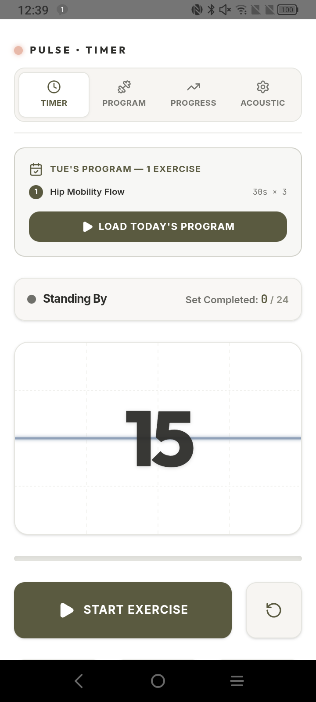
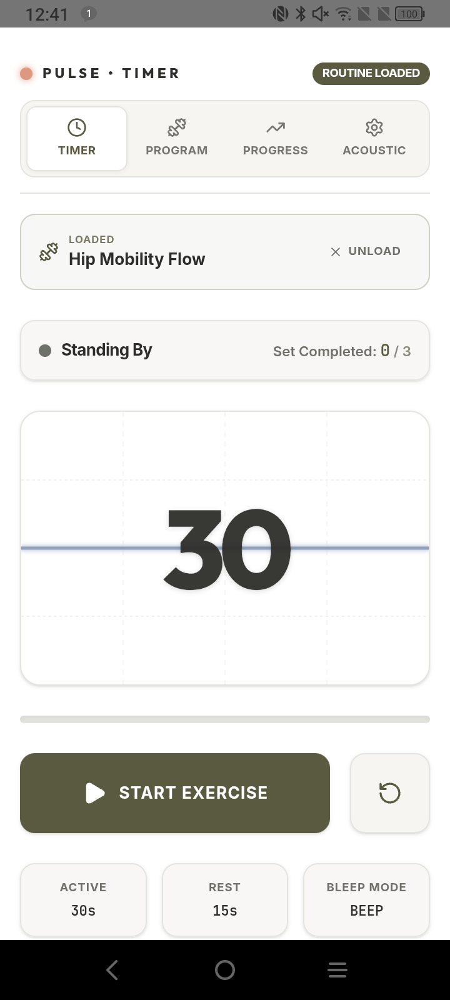
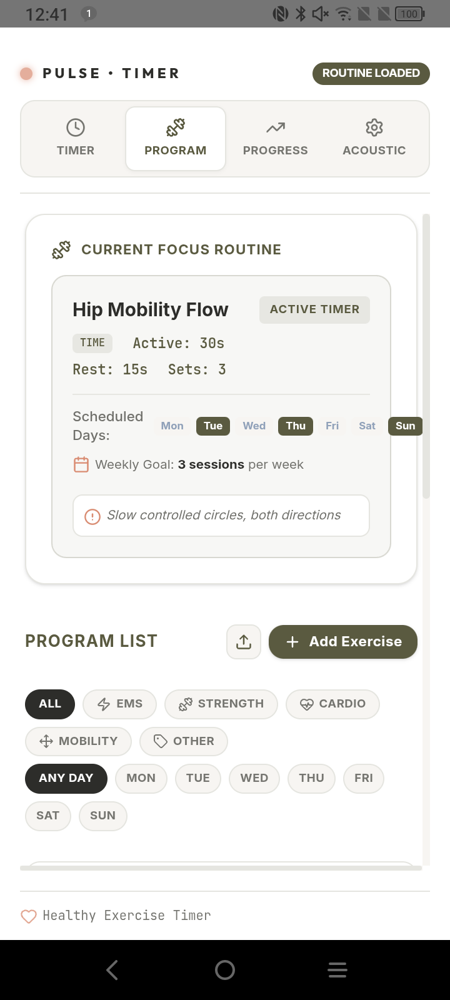
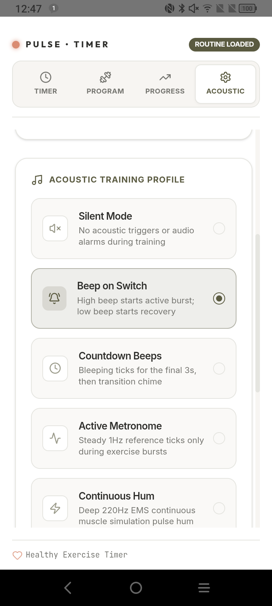
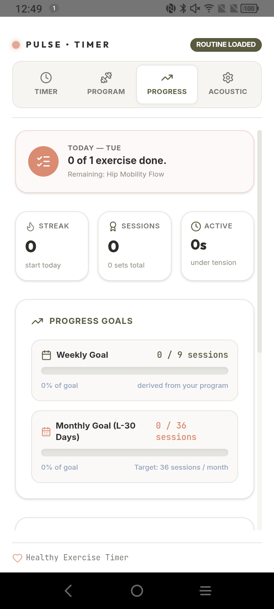

# Pulse — Exercise Timer

Pulse is a clean, offline-first **exercise timer and program tracker** for Android. It started as a precision EMS (Electrical Muscle Stimulation) interval timer and has grown into a general-purpose tool that handles **EMS, strength, cardio, mobility, and hold-based** exercises with equal care.

Whether you're running a physiotherapy routine, timing a circuit, holding a plank for as long as you can, or just trying to do four sets of push-ups without staring at your phone clock — Pulse keeps the rhythm so you don't have to.

  
  

---

## ✨ Features

### Three exercise modes
Every exercise can be configured as one of:

* **Time** — Fixed active duration. Pulse counts down the work phase, then auto-switches to rest.
* **Reps** — No active countdown. Do your reps and tap **Done Set** when finished; rest begins automatically.
* **Hold** — A stopwatch counts *up* from `00:00`. Tap **Stop Hold** when you can't hold any longer. Built for planks, wall-sits, and other "as long as possible" work.

### Custom program builder
* Add, **edit**, **reorder**, and remove exercises.
* Per-exercise: name, category, mode, active/rest duration, sets, reps-per-set, scheduled weekdays, weekly target, and free-form notes.
* Filter the program list by **category** (EMS / Strength / Cardio / Mobility / Other) or by **day of the week**.

  

### Today's auto-loaded superset
* On the home screen, Pulse looks at today's weekday and lists every exercise you've scheduled for it.
* Tap **Load Today's Program** to queue them all in order — Pulse runs them back-to-back, inserts a configurable **between-exercises rest**, and shows an "Up Next" preview during each transition.
* Manual mode still works: pick a single exercise from the Program tab and just that one loads.

### Import / Export plans
* Export your full program as **JSON** or **CSV** with a single tap.
* Import a plan from JSON or CSV — append to your existing list or replace it.
* Downloadable **templates** for both formats so you can build a plan in a spreadsheet or text editor and bring it in cleanly.

### Dynamic waveform & rich audio cues
* Real-time animated waveform indicating the current phase (active / rest / transition).
* Five sound themes (Digital, EMS, Synth, Zen, Arcade) and five sound modes (off, beep, countdown, metronome, continuous).
* Adjustable volume, vibration feedback for phase changes, and a screen wake-lock so the timer never sleeps.

  

### Intelligent progress dashboard
Each completed exercise writes a local log entry. The dashboard surfaces it as:

* **Today's status card** — rest day, partially complete, or all done.
* **Streak counter** — consecutive days with at least one workout.
* **Sessions & active time** — lifetime totals and total time under tension.
* **Weekly & monthly goals** — targets derived automatically from your program, with a week-over-week delta chip.
* **12-week activity heatmap** — GitHub-style consistency view.
* **Top exercises** — your most frequent and longest-time-under-tension movements.
* **Hold personal bests** — your longest single hold per exercise.
* **Full history log** — searchable, with per-entry mode, sets, and best-hold information.

  

### AI Coach's Note (opt-in)
A short, AI-written summary of your last 30 days appears at the top of the Progress tab — adherence wins, exercises trending up or down, and missed scheduled sessions worth checking in on. Plain prose, second-person, two lines max.

* **Off by default.** Enable in **Settings → AI Insights**.
* **Cadence you control.** Pick one weekday for automatic refresh; tap the **Refresh** button on the Progress tab for an on-demand re-roll (max 2 per day, 30-minute cooldown).
* **Privacy-first contract.** Only an aggregated stats blob (~1 KB of counts, durations, adherence percentages, top exercises) leaves the device. **No raw logs, timestamps, notes, IDs, or personal information.**
* **Dismiss anytime.** Tap the × on the card to hide today's note. Turning the feature off wipes every cached insight and refresh-history record from the device.

The Gemini-backed serverless function that writes the prose is open-source at [`pulse-ai-backend`](https://github.com/saitejeswar1/pulse-ai-backend).

### Native Android polish
* **Hardware back button** routes through the tab hierarchy — back from any section returns to the timer; back from the timer exits.
* **Screen wake-lock** keeps the display on for the duration of an active workout.
* **Status and navigation bars stay visible** with proper safe-area handling on Android 15+ (target SDK 36) — content never sits under the system bars or gesture pill.
* **Clean, dark-mode-friendly palette** designed for low-light gym and clinic use.

---

## 📖 How to use Pulse

### 1. Build your program
Head to the **Program** tab and add the exercises you want to track:

* Pick a **category** (EMS, Strength, Cardio, Mobility, Other).
* Pick a **mode** (Time / Reps / Hold) — the form fields adapt to the choice.
* Set duration, sets, reps-per-set, and the **weekdays** you plan to do it.
* Optionally add notes (form cues, therapist instructions, intensity reminders).

You can reorder exercises with the chevron buttons, edit any of them with the pencil icon, or import a full plan via the upload button.

### 2. Run today's program
Open the **Timer** tab. If you've scheduled exercises for today, you'll see them queued up automatically — tap **Load Today's Program** to start running the whole superset, or pick a single exercise manually from the Program tab.

* **Active phase** — moss-green waveform. Contract, move, or hold.
* **Rest phase** — terracotta waveform. Breathe.
* **Transition** — orange pulse with "Up Next" preview. Tap **Skip Rest** to jump to the next exercise immediately.
* **Done Set / Stop Hold** — for rep- and hold-mode exercises, the bottom button ends the active phase on your terms.

### 3. Review your progress
The **Progress** tab shows everything: today's completion status, your streak, weekly/monthly goals, a 12-week heatmap, your top exercises, and your personal best holds.

---

## ⚡ A note on EMS

Pulse keeps full first-class support for **Electrical Muscle Stimulation** routines — including a dedicated EMS sound theme, EMS category, and the original biphasic-waveform visualization. EMS-specific safety still applies:

* Always start at low intensity and follow your physical therapist's guidance.
* Keep stimulation sessions within recommended duration windows.
* Avoid placing electrodes near the heart, on broken skin, or over the carotid sinus.

EMS is one of several use cases Pulse supports today — not the only one.

---

## 🔒 Privacy

* **Local by default.** Your program, settings, and workout history live in your device's `localStorage`. Nothing is uploaded.
* **AI Coach's Note is opt-in.** When enabled, an anonymized aggregate (session counts, durations, adherence percentages, and your top exercises by name) is sent to Pulse's Gemini-backed coach to generate short prose insights. **Raw logs, timestamps, notes, and IDs never leave the device.** Disabling the toggle wipes every cached insight and refresh-history record.
* **No accounts.** No login, no email, no telemetry.
* **Export anytime.** Your data isn't locked in — pull it out as JSON or CSV whenever you want.

---

## 🛠 For developers

Pulse is built with React 19 + TypeScript + Vite + Tailwind, wrapped in Capacitor 8 for Android. The complete development workflow — local dev, asset generation, signed-release builds — lives in [`DEVELOPER.md`](./DEVELOPER.md).
