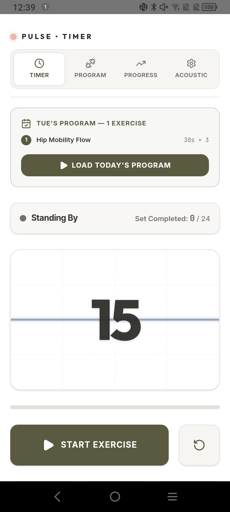
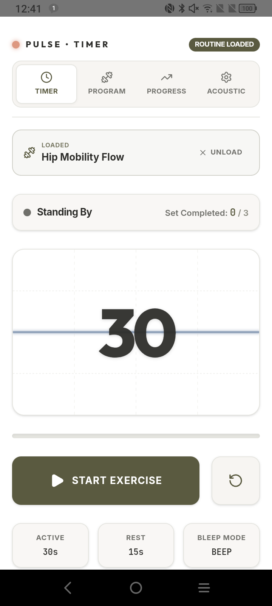

# Rebound
### *Abhyāsena tu kaunteya* — mastery through practice. (Bhagavad Gītā 6.35)

**Rebound** is a clean, offline-first **companion for ACL recovery**. Built on a precision interval-timer core, it turns the long road back from an ACL injury into something you can hold in one hand: build today's plan with a tap, run it on a glanceable timer, log how the knee actually felt, track your load, and climb the **9 recovery levels** at your own pace — all on your device, no account required.

Your reps *are* your *abhyāsa*. Rebound just keeps the rhythm so you don't have to.

  
  

> **Heritage:** Rebound is the ACL-recovery edition of **Pulse**, a general-purpose EMS/strength/mobility timer. It keeps the full timer engine and adds a recovery-tracking layer on top. The general Pulse build lives on the `main` branch.

---

## ✨ What Rebound does

### Today's Plan — built by you, in seconds
There's no rigid weekly schedule to fight. **Your plan for today is whatever you tap in.**

* Tap an exercise tile to **add it to Today's Plan**; tap again to remove it.
* **Quick-add** a whole recovery level with one button — `+ ACL · L{your level}` or the full `ACL plan`.
* **Drag the grip handle to reorder** — put the exercises in the order you actually want to do them.
* Started gym work with a trainer? Add those movements per-tile alongside your physio set.
* A **"yesterday's plan — start fresh?"** banner appears the next day, so you never accidentally re-run a stale plan.

### Three exercise modes
Every exercise can be configured as one of:

* **Time** — Fixed active duration. Rebound counts down the work phase, then auto-switches to rest.
* **Reps** — No active countdown. Do your reps and tap **Done Set** when finished; rest begins automatically.
* **Hold** — A stopwatch counts *up* from `00:00`. Tap **Stop Hold** when you can't hold any longer. Built for planks, wall-sits, isometrics, and other "as long as possible" work.

### Recovery levels & focus
* Tag each exercise with its **recovery level (1–9)** from the ACL guide.
* Set your **current level** in Settings; a **Focus** chip row filters the program to just the levels you're working.
* Every exercise card shows a small `L4`-style badge so you always know where it sits.

### Post-session check-ins
After a session (once per day), a short bottom sheet captures how the knee responded:

* **Pain** (0–10 slider), **swelling** (none / mild / moderate / severe), optional **knee flexion** (°), and an optional note.
* These are the actual gates the guide uses from Level 1 onward — kept short so you'll actually fill them in.

### Progression gates
* A **Progression** sheet lists the verbatim criteria to advance from each level to the next (L1→2 … L8→9).
* Tick each criterion as you meet it; **"Mark Level X complete"** advances your current level.
* Weight-based criteria show an inline hint from your latest matching log — e.g. *"Last: 25 kg × 12 (0.36× BW, target 0.5×)"*, turning green when both load and rep targets are met.

### Weight & load tracking
* Give each exercise a **default load (kg)**, with a one-tap **Bodyweight** shortcut.
* During a workout, a **Weight pill** lets you adjust the load you actually used.
* Set your **bodyweight** in Settings to power the *× BW* progression hints.

### End Session & recap
* Finish early any time with **End Session** — it logs your in-progress work, prompts the daily check-in, and wraps up cleanly.
* A **session recap** card then shows what you did this sitting — *exercises · sets · time under tension* — with a short, contextual note.

### Daily reminder (opt-in)
* A gentle **adherence nudge** at a time you choose: *"You haven't logged a session today."*
* It only fires on days you **haven't** trained — logging any session that day cancels it automatically.
* Fully on-device via your phone's notification system. **Nothing runs in the background**, and there's no account or server.

### Dynamic waveform & rich audio cues
* Real-time animated waveform indicating the current phase (active / rest / transition).
* Five sound themes (Digital, EMS, Synth, Zen, Arcade) and five sound modes (off, beep, countdown, metronome, continuous).
* Adjustable volume, vibration feedback for phase changes, and a screen wake-lock so the timer never sleeps.

### Progress dashboard
Each completed exercise writes a local log entry. The dashboard surfaces:

* **Today's status**, a **streak counter**, lifetime **sessions & time under tension**.
* A **12-week activity heatmap**, your **top exercises**, and **hold personal bests**.
* A searchable **full history log** with per-entry mode, sets, load, and best-hold info.

### AI Coach's Note (opt-in)
A short, AI-written summary of your last 30 days at the top of the Progress tab — adherence wins, trends, and missed sessions worth a look. Off by default; enable in **Settings → AI Coach**. Only an aggregated ~1 KB stats blob ever leaves the device — **no raw logs, timestamps, notes, or IDs**. The Gemini-backed serverless function is open-source at [`pulse-ai-backend`](https://github.com/saitejeswar1/pulse-ai-backend).

### Import / Export plans
* Export your full program as **JSON** or **CSV**; import to append or replace.
* Per-level recovery templates can be brought in cleanly on the phone.

---

## 📖 How to use Rebound

1. **Set your level.** In **Settings**, set your current recovery level and bodyweight. Import the exercises for your level (or add your own).
2. **Build today's plan.** On the **Timer** tab, quick-add your level (`+ ACL · L{n}`) or tap individual tiles. Drag the grip handles to order them how you like.
3. **Run it.** Hit **Start Plan**. Rebound runs your exercises back-to-back with a configurable between-exercise rest and an "Up Next" preview. Use **Done Set / Stop Hold** for rep- and hold-mode work, **Skip Rest** to move on, or **End Session** to finish early.
4. **Check in.** Log pain, swelling, and (optionally) flexion when prompted — it takes seconds and feeds your progression hints.
5. **Climb.** When you meet a level's criteria in the **Progression** sheet, mark it complete and move up.

---

## ⚡ A note on EMS

Rebound keeps full first-class support for **Electrical Muscle Stimulation** routines — a dedicated EMS sound theme, EMS category, and the original biphasic-waveform visualization. EMS-specific safety still applies:

* Always start at low intensity and follow your physical therapist's guidance.
* Keep stimulation sessions within recommended duration windows.
* Avoid placing electrodes near the heart, on broken skin, or over the carotid sinus.

**Rebound is a training and tracking aid, not a medical device.** It does not diagnose, treat, or replace your surgeon or physiotherapist. Follow your clinician's protocol — the recovery criteria here are a convenience, not medical advice.

---

## 🔒 Privacy

* **Local by default.** Your plan, settings, check-ins, and workout history live in your device's `localStorage`. Nothing is uploaded.
* **AI Coach's Note is opt-in.** When enabled, only an anonymized aggregate leaves the device. **Raw logs, timestamps, notes, and IDs never do.** Disabling wipes every cached insight.
* **Reminders stay on-device.** Scheduled locally through your phone's notification system — no server, no push tokens.
* **No accounts.** No login, no email, no telemetry.
* **Export anytime.** Pull your data out as JSON or CSV whenever you want.

---

## 🛠 For developers

Rebound is built with React 19 + TypeScript + Vite + Tailwind, wrapped in Capacitor 8 for Android. The complete development workflow — local dev, asset generation, signed-release builds — lives in [`DEVELOPER.md`](./DEVELOPER.md).
